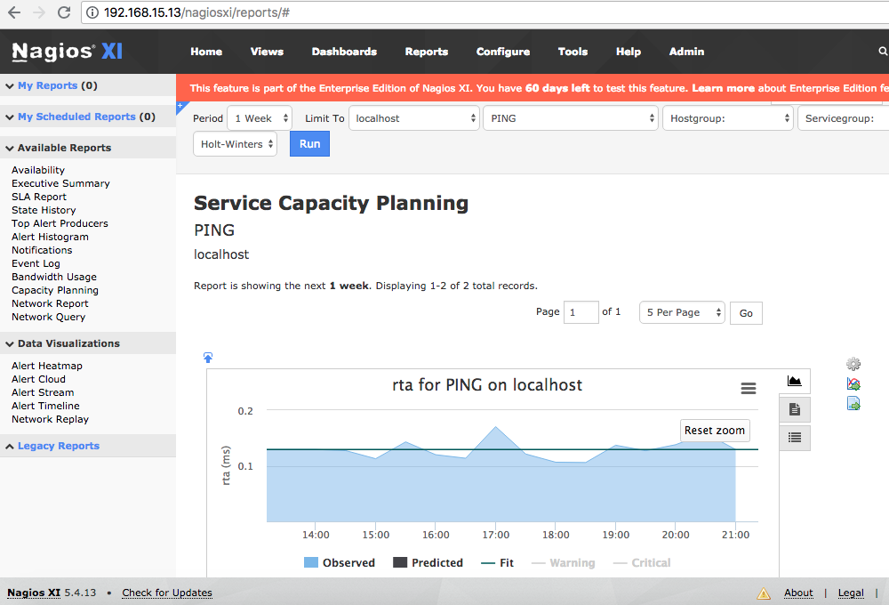
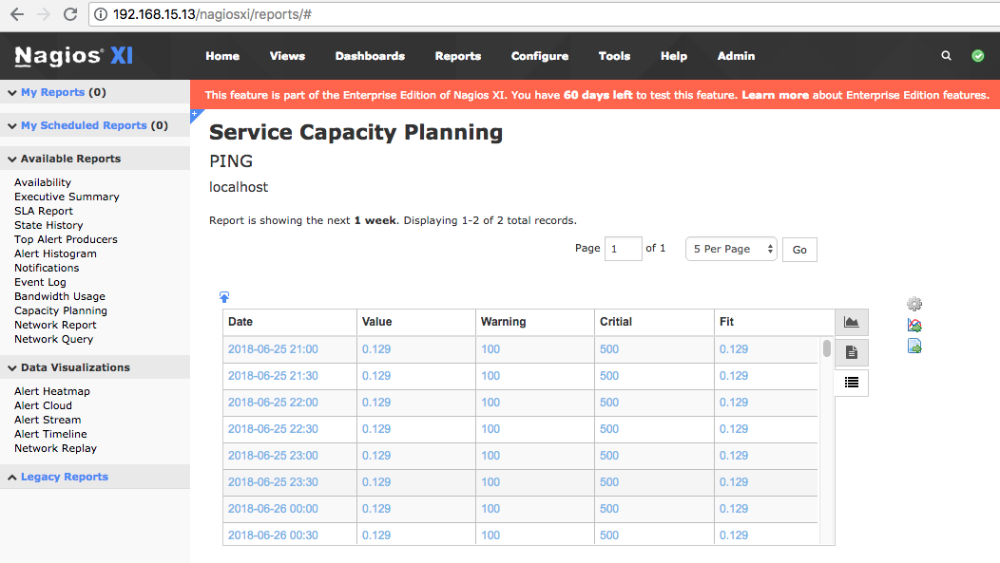

# CPmetrix - Exporting data from capacity planning reports automatically and Massively - Nagios XI :chart_with_upwards_trend:

CPmetrix is a script build in Python and ShellScript to extract capacity planning report values from Nagios XI and transform it to csv, this script get values from all services and hosts with date and time.

## Installation :sunglasses:

```
build -t nagios-xi:centos6-1.0.0 .
docker run -d -p 80:80 --name nagios-xi nagios-xi:centos6-1.0.0
docker exec -it nagios-xi bash

git clone https://github.com/fmaced1/cpmetrix.git ~/cpmetrix
~/cpmetrix/./install_cpmetrix.sh
```

###### Chart


###### Data table


## How it works :rocket:

```
[nagios@localhost cpmetrix]$ ~/cpmetrix/./cpmetrix.sh
 ---> Started: 09-07-2018_22:00:49
 ---> Step 1 - Extract Data to Json Files - Started: 09-07-2018_22:00:49
 -> 1/16 -> /home/nagios/cpmetrix/json_files/localhost-Current_Load-load1-HoltWinters-1Month.json
 -> 2/16 -> /home/nagios/cpmetrix/json_files/localhost-Current_Load-load5-HoltWinters-1Month.json
 -> 3/16 -> /home/nagios/cpmetrix/json_files/localhost-Current_Load-load15-HoltWinters-1Month.json
 -> 4/16 -> /home/nagios/cpmetrix/json_files/localhost-Current_Users-users-HoltWinters-1Month.json
 -> 5/16 -> /home/nagios/cpmetrix/json_files/localhost-_HOST_-rta-HoltWinters-1Month.json
 -> 6/16 -> /home/nagios/cpmetrix/json_files/localhost-_HOST_-pl-HoltWinters-1Month.json
 -> 7/16 -> /home/nagios/cpmetrix/json_files/localhost-_HOST_-rtmax-HoltWinters-1Month.json
 -> 8/16 -> /home/nagios/cpmetrix/json_files/localhost-_HOST_-rtmin-HoltWinters-1Month.json
 -> 9/16 -> /home/nagios/cpmetrix/json_files/localhost-HTTP-time-HoltWinters-1Month.json
 -> 10/16 -> /home/nagios/cpmetrix/json_files/localhost-HTTP-size-HoltWinters-1Month.json
 -> 11/16 -> /home/nagios/cpmetrix/json_files/localhost-PING-rta-HoltWinters-1Month.json
 -> 12/16 -> /home/nagios/cpmetrix/json_files/localhost-PING-pl-HoltWinters-1Month.json
 -> 13/16 -> /home/nagios/cpmetrix/json_files/localhost-Root_Partition-_-HoltWinters-1Month.json
 -> 14/16 -> /home/nagios/cpmetrix/json_files/localhost-SSH-time-HoltWinters-1Month.json
 -> 15/16 -> /home/nagios/cpmetrix/json_files/localhost-Swap_Usage-swap-HoltWinters-1Month.json
 -> 16/16 -> /home/nagios/cpmetrix/json_files/localhost-Total_Processes-procs-HoltWinters-1Month.json
 ---> Step 1 - Extract Data to Json Files - Completed: 09-07-2018_22:00:55
 ---> Step 2 - Convert Json to Text Data - Started: 09-07-2018_22:00:55
 -> 1/16 -> /home/nagios/cpmetrix/csv_files/localhost-Current_Load-load15-HoltWinters-1Month.csv
 -> 2/16 -> /home/nagios/cpmetrix/csv_files/localhost-Current_Load-load1-HoltWinters-1Month.csv
 -> 3/16 -> /home/nagios/cpmetrix/csv_files/localhost-Current_Load-load5-HoltWinters-1Month.csv
 -> 4/16 -> /home/nagios/cpmetrix/csv_files/localhost-Current_Users-users-HoltWinters-1Month.csv
 -> 5/16 -> /home/nagios/cpmetrix/csv_files/localhost-_HOST_-pl-HoltWinters-1Month.csv
 -> 6/16 -> /home/nagios/cpmetrix/csv_files/localhost-_HOST_-rta-HoltWinters-1Month.csv
 -> 7/16 -> /home/nagios/cpmetrix/csv_files/localhost-_HOST_-rtmax-HoltWinters-1Month.csv
 -> 8/16 -> /home/nagios/cpmetrix/csv_files/localhost-_HOST_-rtmin-HoltWinters-1Month.csv
 -> 9/16 -> /home/nagios/cpmetrix/csv_files/localhost-HTTP-size-HoltWinters-1Month.csv
 -> 10/16 -> /home/nagios/cpmetrix/csv_files/localhost-HTTP-time-HoltWinters-1Month.csv
 -> 11/16 -> /home/nagios/cpmetrix/csv_files/localhost-PING-pl-HoltWinters-1Month.csv
 -> 12/16 -> /home/nagios/cpmetrix/csv_files/localhost-PING-rta-HoltWinters-1Month.csv
 -> 13/16 -> /home/nagios/cpmetrix/csv_files/localhost-Root_Partition-_-HoltWinters-1Month.csv
 -> 14/16 -> /home/nagios/cpmetrix/csv_files/localhost-SSH-time-HoltWinters-1Month.csv
 -> 15/16 -> /home/nagios/cpmetrix/csv_files/localhost-Swap_Usage-swap-HoltWinters-1Month.csv
 -> 16/16 -> /home/nagios/cpmetrix/csv_files/localhost-Total_Processes-procs-HoltWinters-1Month.csv
 ---> Step 2 - Convert Json to Text Data - Completed: 09-07-2018_22:01:00
```
## Json2csv

After extraction the script will add date and time to values and convert Json files to CSV, take a look 
at the csv files in the ~/cpmetrix/csv_files/

###### Before
```
{
  "emax": 0.54222041239193719, 
  "eslope": 2.7377652486612215e-12, 
  "evalue_max": 0.31298062284624784, 
  "t_start": 1526346000, 
  "warn_level": 5.0, 
  "dmean": 0.36120138888887265, 
  "t_stop": 1533605400, 
  "dmax": 0.99794444444444441, 
  "integrity": 0.005950167348456659, 
  "unit": null, 
  "residue": 1.6925946512378887, 
  "emean": 0.30871216336560725, 
  "edate": 1533603600, 
  "evalue": 0.28788708762035464, 
  "nd": 2688.0, 
  "ne": 1344.0, 
  "evalue_min": 0.26279355239446145, 
  "adjusted_sigma": 4.217282263901688, 
  "t_step": 1800, 
  "crit_level": 10.0, 
  "f_of_x_on_date": 0.36121463529226805, 
  "sigma": 0.025093535225893204, 
  "highcharts": [
    {
      "pointStart": 1526346000000, 
      "pointInterval": 1800000, 
      "type": "area", 
      "name": "Observed", 
      "data": [
        0.36120138888888886, 
```

###### After

```
summary_data,0.542220412392,2.73776524866e-12,0.312980622846,1526346000,0.361201388889,1533605400,0.997944444444,0.00595016734846,None,1.69259465124,0.308712163366,1533603600,0.28788708762,2688.0,1344.0,0.262793552394,4.2172822639,1800,0.361214635292,0.0250935352259
x_data_observed,1526346000000,1800000,area,Observed
Observed,2018-05-14 22:00:00,0.361201388889,5.0,10.0
Observed,2018-05-14 22:30:00,0.361201388889,5.0,10.0
Observed,2018-05-14 23:00:00,0.361201388889,5.0,10.0
Observed,2018-05-14 23:30:00,0.361201388889,5.0,10.0
Observed,2018-05-15 00:00:00,0.361201388889,5.0,10.0
Observed,2018-05-15 00:30:00,0.361201388889,5.0,10.0
Observed,2018-05-15 01:00:00,0.361201388889,5.0,10.0
Observed,2018-05-15 01:30:00,0.361201388889,5.0,10.0
Observed,2018-05-15 02:00:00,0.361201388889,5.0,10.0
Observed,2018-05-15 02:30:00,0.361201388889,5.0,10.0
Observed,2018-05-15 03:00:00,0.361201388889,5.0,10.0
Observed,2018-05-15 03:30:00,0.361201388889,5.0,10.0
Observed,2018-05-15 04:00:00,0.361201388889,5.0,10.0
Observed,2018-05-15 04:30:00,0.361201388889,5.0,10.0
Observed,2018-05-15 05:00:00,0.361201388889,5.0,10.0
Observed,2018-05-15 05:30:00,0.361201388889,5.0,10.0
Observed,2018-05-15 06:00:00,0.361201388889,5.0,10.0
Observed,2018-05-15 06:30:00,0.361201388889,5.0,10.0
Observed,2018-05-15 07:00:00,0.361201388889,5.0,10.0
Observed,2018-05-15 07:30:00,0.361201388889,5.0,10.0
Observed,2018-05-15 08:00:00,0.361201388889,5.0,10.0
Observed,2018-05-15 08:30:00,0.361201388889,5.0,10.0
Observed,2018-05-15 09:00:00,0.361201388889,5.0,10.0
Observed,2018-05-15 09:30:00,0.361201388889,5.0,10.0
Observed,2018-05-15 10:00:00,0.361201388889,5.0,10.0
Observed,2018-05-15 10:30:00,0.361201388889,5.0,10.0
Observed,2018-05-15 11:00:00,0.361201388889,5.0,10.0
Observed,2018-05-15 11:30:00,0.361201388889,5.0,10.0
Observed,2018-05-15 12:00:00,0.361201388889,5.0,10.0
```
